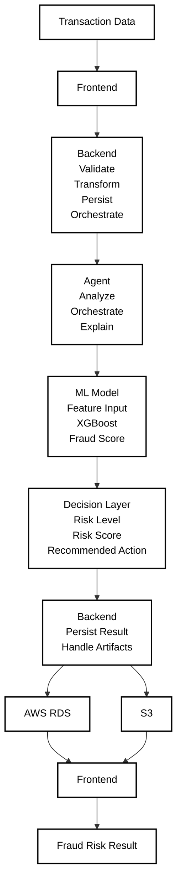
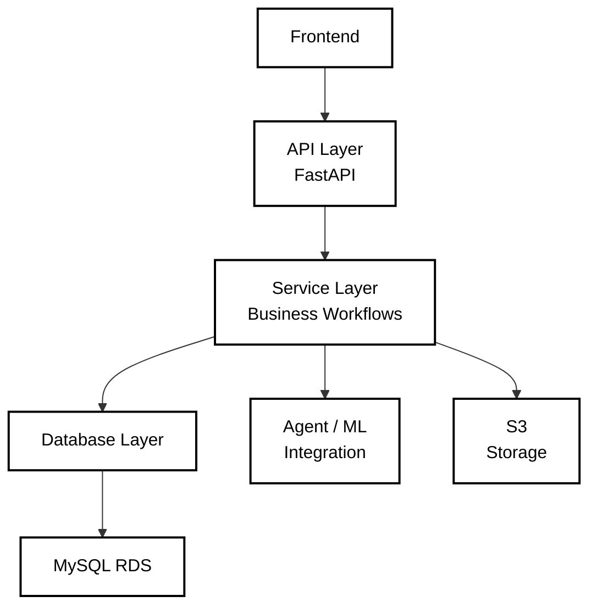

# LossLess Engine (AI Risk Manager) : Backend

Production-grade backend for fraud risk detection that connects user-facing applications with machine learning intelligence through reliable service orchestration, data persistence, and validated workflows.

---

## Overview

The LossLess Engine Backend is the operational application layer between the React frontend, the fraud-analysis Agent, the deployed ML model, and persistent storage systems. It does not perform fraud classification itself; instead, it provides the infrastructure required to make fraud intelligence actionable.

**Core responsibility:** Transform user requests into validated workflows, orchestrate AI services, persist transaction state, manage artifacts, and return structured results to the frontend.

---

## System Context



---

## Technology Stack

| Category | Technologies |
|----------|--------------|
| **Runtime** | Python 3.11 · FastAPI · Uvicorn |
| **Validation** | Pydantic · Type hints |
| **Persistence** | SQLAlchemy · PyMySQL · MySQL (AWS RDS) |
| **Object Storage** | AWS S3 · Boto3 · Presigned URLs |
| **External Services** | HTTPX · REST-based Agent/ML integration |
| **Configuration** | python-dotenv · Environment variables |
| **Testing** | Pytest · FastAPI TestClient |
| **Containerization** | Docker · Docker Hub |
| **Deployment** | Render · AWS RDS · AWS S3 |

---

## Architecture

### Layered Design



This separation ensures:
- **API concerns** (HTTP, routing, serialization) isolated from business logic
- **Service orchestration** (Agent calls, decision flows) independent of storage
- **Database transactions** handled consistently across all workflows
- **External service** communication (failures, timeouts) managed centrally

---

## Project Responsibilities

| Component | Responsibility |
|-----------|-----------------|
| **Backend** | Request validation, transaction management, persistence, Agent orchestration, batch workflows, error handling, CORS |
| **Agent** | Fraud analysis, risk tool execution, ML prediction retrieval, decision making, explainability |
| **ML Model** | Feature validation, XGBoost inference, fraud probability generation |
| **RDS** | Transaction records, analysis results, feedback, application state |
| **S3** | Uploaded source files, result artifacts, generated reports |

---

## Project Structure

```
backend/
├── main.py                          # FastAPI application entrypoint
├── config.py                        # Configuration & environment management
│
├── app/
│   ├── api/
│   │   ├── routes/                  # Route handlers
│   │   │   ├── transactions.py      # Transaction endpoints
│   │   │   ├── analysis.py          # Analysis endpoints
│   │   │   ├── batch.py             # Batch processing
│   │   │   └── health.py            # Health checks
│   │   └── dependencies.py          # Dependency injection
│   │
│   ├── services/
│   │   ├── transaction_service.py   # Transaction business logic
│   │   ├── analysis_service.py      # Analysis orchestration
│   │   ├── agent_service.py         # Agent communication
│   │   ├── batch_service.py         # Batch workflow logic
│   │   └── storage_service.py       # S3 artifact handling
│   │
│   ├── models/
│   │   ├── transaction.py           # Transaction ORM model
│   │   ├── analysis.py              # Analysis result model
│   │   └── feedback.py              # Feedback model
│   │
│   ├── schemas/
│   │   ├── transaction.py           # Transaction validation schemas
│   │   ├── analysis.py              # Analysis response schemas
│   │   └── batch.py                 # Batch operation schemas
│   │
│   └── database/
│       ├── connection.py            # SQLAlchemy engine & session factory
│       ├── models.py                # Declarative base & table definitions
│       └── migrations/              # Alembic database migrations
│
├── Dockerfile                       # Container specification
├── requirements.txt                 # Python dependencies
├── .env.example                     # Environment template
├── pytest.ini                       # Pytest configuration
└── .gitignore
```

---

## Core Features

### Request Validation

All incoming data validated through Pydantic before entering business logic:

```python
class TransactionRequest(BaseModel):
    transaction_id: str
    amount: float
    currency: str
    merchant: str
    customer_id: str
    # ... additional fields
```

**Benefits:** Type safety, early error detection, automatic OpenAPI documentation.

### Transaction Persistence

Each transaction stored in RDS with lifecycle tracking:

- **Created**: Initial ingestion
- **Analyzed**: Agent results received
- **Completed**: Final decision persisted
- **Failed**: Error state with retry capability

### Service Orchestration

Backend coordinates between stateless AI services and persistent state:

1. **Receive** validated transaction from frontend
2. **Persist** transaction record to RDS
3. **Call** Agent service for fraud analysis
4. **Update** transaction with decision and evidence
5. **Return** structured response to frontend

### Batch Processing

Handle multiple transactions efficiently:

- CSV file uploaded to S3
- Batch job created and tracked in RDS
- Transactions processed through Agent in parallel
- Results aggregated and persisted
- Reports generated and accessible via presigned URLs

### Database Transactions

Critical operations wrapped in database transactions:

```python
# Request received
session = SessionLocal()
try:
    transaction = create_transaction(session, data)
    session.flush()  # Validate schema constraints
    
    # Call external service
    result = await agent_service.analyze(transaction)
    
    # Update record with results
    update_transaction_result(session, transaction, result)
    session.commit()  # Atomic: all or nothing
    
except Exception:
    session.rollback()
    raise
finally:
    session.close()
```

This ensures consistency: if the Agent call succeeds but the update fails, the transaction is rolled back entirely.

---

## Getting Started

### Prerequisites

- Python 3.11+
- Docker
- AWS credentials (RDS and S3)
- Deployed Fraud Agent service
- Deployed ML model service

### Local Development

```bash
# Clone repository
git clone https://github.com/Y-K-SAI-SRIKAR/AIRiskManagerBackend
cd  AIRiskManagerBackend
pip install -r requirements.txt

# Configure environment
cp .env
# Edit .env with your AWS and service credentials

# Run locally
uvicorn app.main:app --reload --port {port}
# API docs: http://localhost:8000/docs
# ReDoc: http://localhost:8000/redoc
```

### Database Setup

```bash
# Run migrations
alembic upgrade head

# Verify connection
python -c "from app.database.connection import engine; engine.connect()"
```

### Testing

```bash
# Run all tests
pytest

# Run with coverage
pytest --cov=app tests/

# Run specific test file
pytest tests/test_transaction_service.py -v
```

---

## Docker Deployment

```bash
# Build image
docker build -t ai-risk-manager-bakcend:backend .

# Push to registry
docker push <registry>/ai-risk-manager-backend:backend

# Deploy to Render (or Kubernetes)
# Services expect environment variables for all infrastructure details
```

---

## Key Design Principles

1. **Separation of Concerns** : API, services, models, schemas, and database layers are independent
2. **Validation First** : Untrusted input validated before entering business logic
3. **Transaction Safety** : Database changes atomic: all succeed or all rollback
4. **Service Isolation** : Backend does not duplicate Agent or ML responsibilities
5. **Configuration Through Environment** : Infrastructure details externalized
6. **Reproducible Deployment** : Docker ensures dev/prod parity
7. **Stateless Services** : Backend state persisted in RDS, not process memory
8. **Object Storage for Large Files** : Artifacts stored in S3, not database
9. **Explicit Failure Handling** : External dependency failures expected and managed
10. **Incremental Development** : Functionality validated progressively before deployment

---

## Monitoring & Maintenance

### Key Metrics

- API response latency (p50, p95, p99)
- Error rate by endpoint
- Database connection pool utilization
- Agent service availability and latency
- S3 API call frequency and performance
- Transaction success rate
- Analysis completion rate

### Common Issues

**Database Connection Timeout**
- Check RDS security group allows access from backend
- Verify DB_HOST, DB_PORT, and credentials in environment
- Check connection pool size: `pool_size=20, max_overflow=10`

**Agent Service Unreachable**
- Verify AGENT_URL in environment
- Check Agent service is running and responding to health check
- Increase AGENT_TIMEOUT if service is slow

**S3 Upload Failures**
- Verify AWS credentials and region
- Check S3 bucket exists and backend IAM role has `s3:PutObject`
- Verify bucket policy allows cross-account access if needed

---

## Security Best Practices

- **Secrets**: All credentials via environment variables, never committed to source control
- **Data Validation**: Pydantic schemas enforce type and value constraints before processing
- **SQL Injection**: SQLAlchemy ORM prevents injection; parameterized queries used throughout
- **CORS**: Frontend domain whitelisted in deployment
- **TLS**: All external communication over HTTPS
- **Database**: Connection pooling with `pool_pre_ping=True` to detect stale connections
- **Temporary Files**: Uploaded CSVs processed and deleted immediately
- **Presigned URLs**: S3 access controlled through time-limited presigned URLs

---

## License

This project is licensed under the MIT License. see the [LICENSE](LICENSE) file for details.

---

## System Integration

The backend is one component in a complete fraud-detection platform:

```
Frontend (React)
    ↓ HTTPS
Backend (FastAPI)
    ↓ HTTP
Agent Layer (FastAPI)
    ↓ HTTP
ML Model (XGBoost)
    ↓
Fraud Probability
    ↓
Backend (Persist)
    ↓
RDS + S3
```

Each layer is independently deployable, scalable, and testable. The backend provides the orchestration that makes this distributed system operate as a cohesive fraud-detection platform.

---

**Maintained by:** YERRAGUNTLA KAMESWARA SAI SRIKAR
**Last Updated:** September 03, 2026.